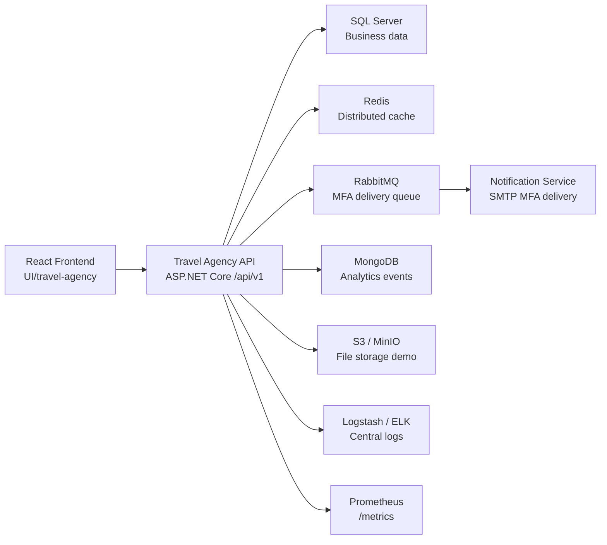

# Travel Agency Architecture Notes

## Current Architecture

The system is implemented as a React frontend, ASP.NET Core Web API, notification microservice, SQL Server database, and optional enterprise infrastructure stack.

## Backend Layers

- `Controllers`
  Expose REST endpoints for auth, users, places, hotels, packages, bookings, stats, contact messages, and infrastructure demos.
- `Dtos`
  Request/response models used when API input differs from database entities.
- `Models`
  Domain and request data structures.
- `Services`
  Shared logic such as database access, token generation, MFA, RabbitMQ delivery, alerts, analytics, storage, and password hashing.
- `Data`
  Entity Framework Core context for support tables such as MFA codes, audit logs, and metrics snapshots.
- `Middleware`
  Cross-cutting concerns such as request logging and exception handling.
- `Filters`
  Unified API response shaping and Swagger examples.

## Microservice Boundary

The project includes one concrete microservice split:

- Main API: owns travel-agency workflows and publishes MFA delivery messages.
- Notification service: consumes RabbitMQ messages and sends MFA codes through SMTP.

This keeps the coursework app understandable while still demonstrating microservice communication and asynchronous processing.

## Deployment Architecture

The repository includes three deployment levels:

- Local development with API + React + SQL Server.
- Docker Compose enterprise stack with NGINX, Redis, RabbitMQ, notification service, SQL Server, MongoDB, MinIO, ELK, Prometheus, Grafana, Alertmanager, and backup helper.
- Kubernetes manifests with API replicas, notification-service deployment, Redis, RabbitMQ, SQL Server, ingress, HPA, secrets/config examples, and backup CronJob.

## Presentation Guidance

Present the system as a modular REST API with a supporting notification microservice and production-aware infrastructure examples. The implementation covers the requested concepts, while real production rollout would still need environment-specific secrets, TLS certificates, domains, cloud resources, and provider-specific monitoring dashboards.
